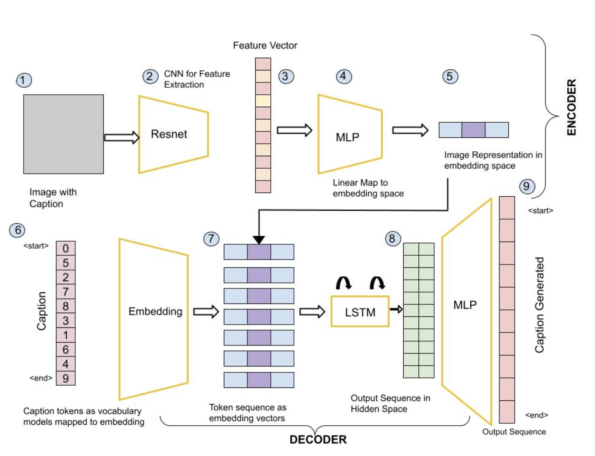
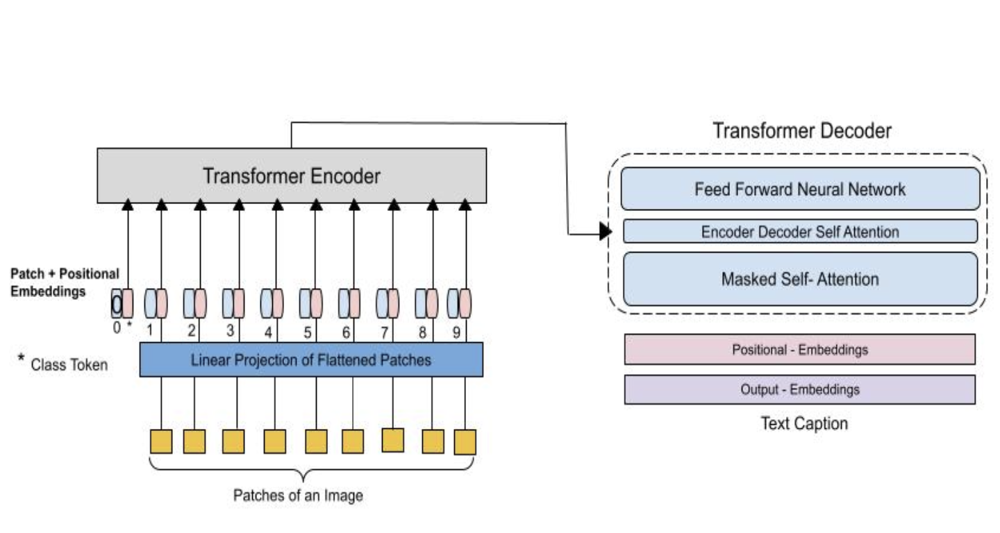

# Image Captioning (CS60010 Spring 2024)

# CNN + LSTM Architecture

## Problem Statement
Design a simple CNN-based encoder for the image and RNN-based decoder model for the task and report results on the given test set.

## Details
-> ResNet-50 Architecture is utilised for extracting the features from the images. ( weights are freezed )
-> LSTM with 256 hidden units was utlised as the decoder.

# ViT + GPT-2 Architecture

## Problem Statement
Design a transformer based encoder decoder model using a Vision Transformer (ViT) as the image encoder and a text decoder of your choice.

## Details 
-> ViT base was used as encoder model, GPT-2 was used as the decoder model with already pretrained weights from hugging face (nlpconnect/vit-gpt2-image-captioning). The pretrained model was finetuned on our dataset for 3 epochs.

